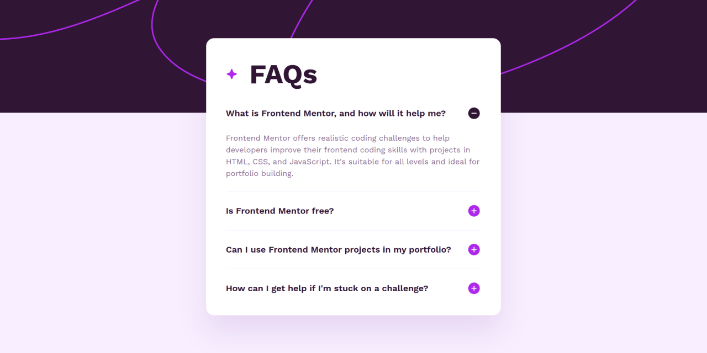
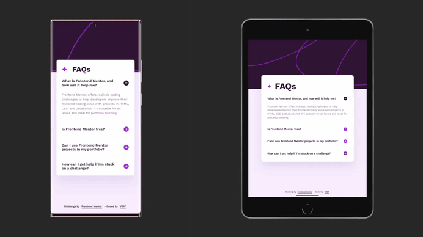

# 🚀 FAQ accordion

A responsive FAQ accordion built with semantic HTML and modern CSS. It uses the native `
` and `
` elements to deliver an accessible, keyboard-friendly experience without JavaScript.

## 🔗 Links

- 🌎 [Live site](https://vimpdev.github.io/fem-js-newbie-06-faq-accordion/)
- 📌 [Frontend Mentor solution](https://www.frontendmentor.io/solutions/faq-accordion-semantic-html-and-modern-css-3R-R23x1a8)

## 🎬 Demo

## 📸 Screenshots

| 📱 Mobile | 📲 Tablet | 🖥️ Desktop |
| --- | --- | --- |
|  |  |  |

## ✨ Features

- Accessible accordion built with native HTML elements and full keyboard support
- Responsive layout for mobile, tablet, and desktop
- Hover and focus states for interactive elements
- No JavaScript required

## 🛠 Tech Stack

- Semantic HTML5
- Modern CSS
- CSS Custom Properties
- CSS Nesting
- Cascade Layers
- Flexbox
- CSS Grid
- Mobile-first workflow
- Native `
` and `
`

## 💡 Development highlights

This project focuses on maintainable CSS through cascade layers, semantic design tokens, and a mobile-first workflow. It also demonstrates how native `
` and `
` elements can replace JavaScript for common UI patterns while preserving accessibility.

## 🤖 AI Collaboration

AI was used as a learning companion to review code, discuss architectural decisions, and validate best practices. All implementation and final technical decisions remained part of the development process.

## 👩‍💻 Author

- Frontend Mentor – [@vimpdev](https://www.frontendmentor.io/profile/vimpdev)

## 🎯 Challenge Source

This project was built as a solution to the
[FAQ Accordion Challenge](https://www.frontendmentor.io/challenges/faq-accordion-wyfFdeBwBz)
created by Frontend Mentor.

Frontend Mentor provides professionally designed UI challenges that help developers practice real-world frontend development by building realistic projects.